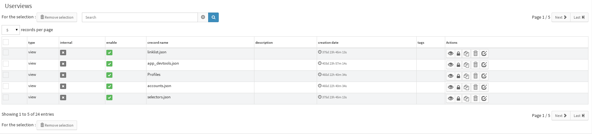

.. _user-ui-userviews:

Userviews
=========

Concept
-------

In Canopsis' frontend, almost everything element an user can see is wrapped in a container called view.

Main view and Sattelite views
^^^^^^^^^^^^^^^^^^^^^^^^^^^^^

There is 2 main categories of views :

- The view that presents the content the user asked for. They basically represent dashboards and present informations that the user really care for. These views represent the ``main view``.
- Views that decorates the content. They usually contains session informations, menus, buttons (log out, profile, and so on ...), or informations that are needed on each view (header, footer). These are the ``sattelite views``.

To sum up, main view will change between pages, and sattelite views tends not to vary during user session.

Regular views disposition
^^^^^^^^^^^^^^^^^^^^^^^^^

By default, views are arranged as listed below:

- Sattelite view: ``view.app_header``
- Main view (depending on the current page)
- Sattelite view: ``view.app_footer``

Main view features
^^^^^^^^^^^^^^^^^^

On the top right of the main view are located some view actions :

+----------------+--------------------------------------------------------+------------------------------+
|``refresh``     | .. image:: ../../../_static/images/views/refresh.png   | Manually refreshes the view  |
+----------------+--------------------------------------------------------+------------------------------+

+-----------------------+-----------------------------------------------------------+---------------------------------------------------------------------------------------------------------------------------------------+
|``Toggle flullscreen`` | .. image:: ../../../_static/images/views/fullscreen.png   | Hide menus, tabs, header and footer, and displays only the main view (or go back to the normal display if already in fullscreen mode) |
+-----------------------+-----------------------------------------------------------+---------------------------------------------------------------------------------------------------------------------------------------+

Manage views
------------

A special view, called `userviews`,  is included in Canopsis UI.
It's in fact a view manager/browser.
You can access it with a menu like on screenshot :

As a result, you'll get :

For each view, some actions are available :

+---------------+--------------------------------------------------------------------+--------------------------------------+
| ``View``      |  .. image:: ../../../_static/images/views/userviews_view.png       | Go to the pointed View in read mode  |
+---------------+--------------------------------------------------------------------+--------------------------------------+
| ``Rights``    |  .. image:: ../../../_static/images/views/userviews_rights.png     | Edit actual view's rights            |
+---------------+--------------------------------------------------------------------+--------------------------------------+
| ``Duplicate`` |  .. image:: ../../../_static/images/views/userviews_duplicate.png  | Allow you to duplicate the view      |
+---------------+--------------------------------------------------------------------+--------------------------------------+
| ``Remove``    |  .. image:: ../../../_static/images/views/userviews_remove.png     | Remove the View                      |
+---------------+--------------------------------------------------------------------+--------------------------------------+
| ``Edit``      |  .. image:: ../../../_static/images/views/userviews_edit.png       | Edit the record name                 |
+---------------+--------------------------------------------------------------------+--------------------------------------+

Create a view
-------------

To add a view click on the button on the top left, a menu appear.
Click on "Add a view" as following :

 .. image:: ../../../_static/images/views/add_view.png

Delete a view
-------------

Click on the left top button and on "Edit current view" as following :

 .. image:: ../../../_static/images/views/delete_view_1.png

A new toolbar appear, click on the trash icon to delete the current view :

 .. image:: ../../../_static/images/views/delete_view_2.png
Click on "Save changes" to confirm

Edit view
---------

Click on the left top button and on "Edit current view" as following :

 .. image:: ../../../_static/images/views/delete_view_1.png

A new toolbar appear, click on the pencil icon to edit the current view :

 .. image:: ../../../_static/images/views/delete_view_3.png

You can add widgets too by click on the "insert widget" button.

Header and Footer
----------------

By the edition of Header and footer views, you personnalise you interface with your preferences,
you can add anywidget you want (make sure of the configuration of the widget before save changes).
You may the interface be yours.

Edit header
^^^^^^^^^^^

Click on the left top button and on "Manage views" as following :

 .. image:: ../../../_static/images/views/add_header_1.png

Select "app_header.json" and click on the eye button on the right of the line :

 .. image:: ../../../_static/images/views/add_header_2.png

Now you can click on on the pencil icon to edit the current header :

 .. image:: ../../../_static/images/views/edit_header_1.png

In this new screen you can delete or add or modify labels ans their values :

 .. image:: ../../../_static/images/views/edit_header_2.png

You can create short cut to your different views.
By this way you personnalise your interface with your preferences.

Edit footer
^^^^^^^^^^^

Click on the left top button and on "Manage views" as following :

 .. image:: ../../../_static/images/views/add_header_1.png

Select "app_footer.json" and click on the eye button on the right of the line :

 .. image:: ../../../_static/images/views/add_header_2.png

Now you can click on on the pencil icon to edit the current footer.
In this new screen you can modifie widget title, template and other options so you can personnalise the interface by modifying templates and others options

The default footer show you the states of series (info, minor, major, critical) but you can show what you want (events, metrics, series, mixin...).

You can observe header and footer you've choosen all over the interface.