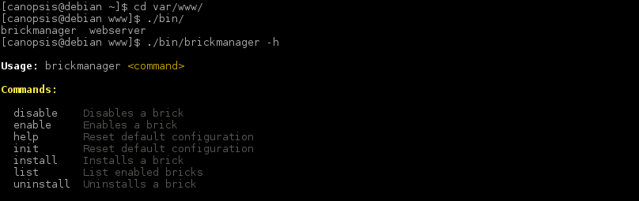
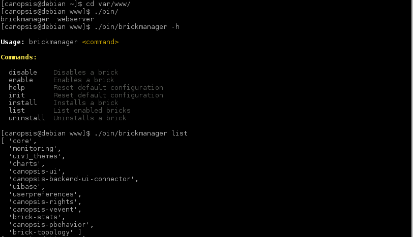
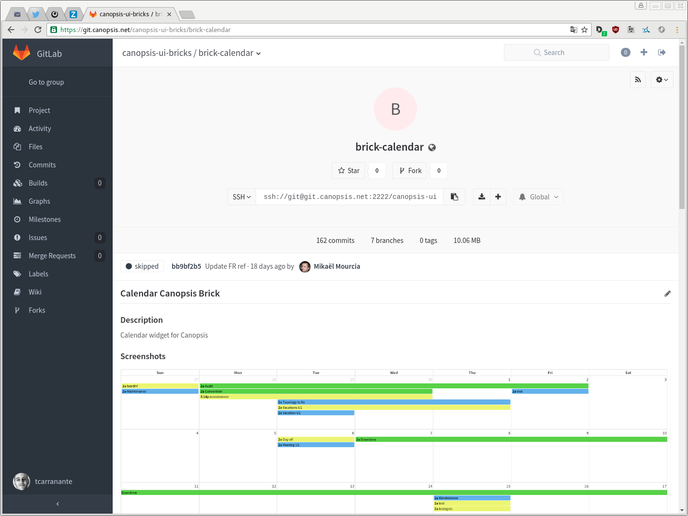
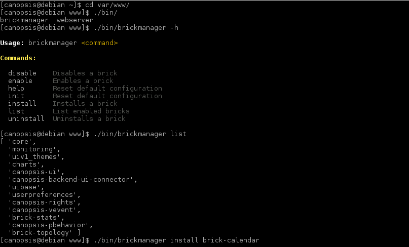
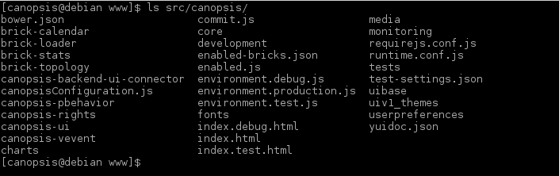
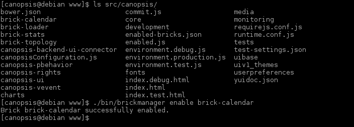
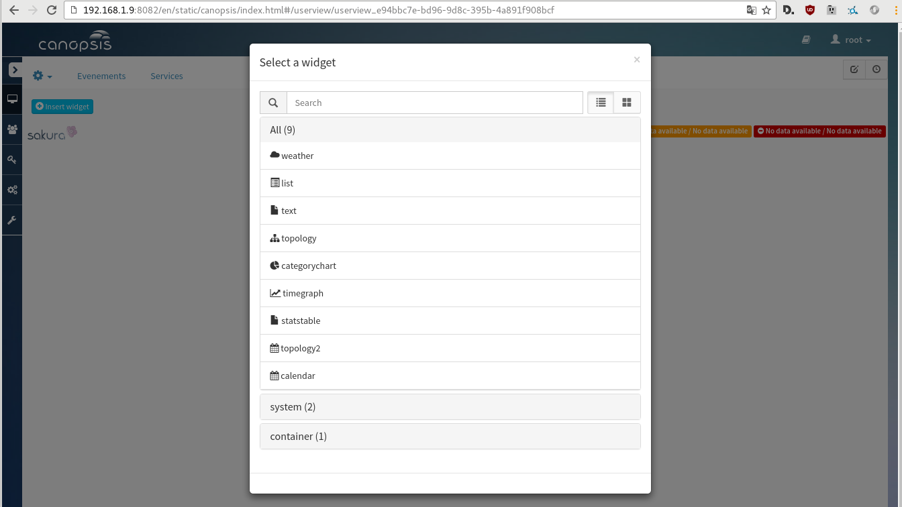

======================================
How to install a new brick in canopsis
======================================

In this step by step tutorial you will be guided trough the procedure to install a new canopsis brick in your UI. First boot up your canopsis. Connect on the canopsis server or get a real keyboard.

    $ su - canopsis
    $ cd var/www/

Here we're ready to go. We're going to use the brick manager, a tool created to manage bricks. You can display the help to see which actions the manager can do.

    $ ./bin/brickmanager -h

which should bring up this :

You can list all the installed brick with the following command.

    $ ./bin/brickmanager list

You will see all the basic canopsis bricks.

Now it's shopping time, go on the `brick repository <https://git.canopsis.net/groups/canopsis-ui-bricks>`_ and pick the brick you want. In this tutorial I'm going on with the brick-calendar, because it's good to to keep a calendar at hand.

Copy in your clipboard the name of the brick, go on your terminal and then :

    $ ./bin/brickmanager install brick-calendar

Change the "brick-calendar" part with the name of the brick you want.

Depending on the speed of your internet access and the weight of the brick the installation can take some times.

If you curious you can list the directory in the canopsis directory

    $ ls src/canopsis

Now the brick is installed, last step, enable it.

    $ ./bin/brickmanager enable brick-calendar

You are now ready to use all the feature the brick add. In the case of brick-calendar we can see the new widget in the widget list.

