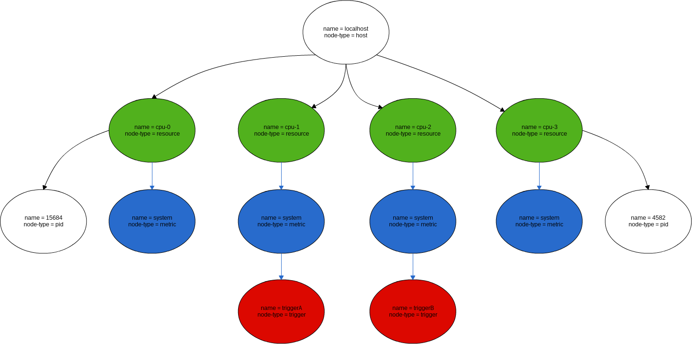

.. _FR__GraphModel:

====================
Canopsis Graph Model
====================

This document describes the requirements of the Canopsis graph model.

.. contents::
   :depth: 3

References
==========

List of referenced functional requirements:

Updates
=======

.. csv-table::
   :header: "Author(s)", "Date", "Version", "Summary", "Accepted by"

   "David Delassus", "2016/05/25", "0.1", "Document creation", ""
   "David Delassus", "2016/05/30", "0.2", "Add constraint module", ""

Contents
========

.. _FR__GraphModel__Desc:

Description
-----------

All data in Canopsis **MUST** be modeled into a graph (including the graph itself),
in order to make the user able to query them just by walking the graph.

.. _FR__GraphModel__Meta:

Meta model
----------

.. figure:: _static/images/graph/metamodel.png

.. _FR__GraphModel__POV:

Point of View
-------------

The *Complex Relationship* gives the ability to walk through the graph with multiple point of views.

For example:

 - we have 3 machines
 - the 3 machines provide a clustered service
 - on each of these machines, there is a process providing a cluster node

.. figure:: _static/images/graph/pov.png

In this example we have:

 - a virtual node representing the clustered service
 - 3 nodes representing the physical machines
 - 3 complex relationships (in blue) where the inner node describes the cluster node (the process)
 - those relationships link together the clustered service to the physical machines

We can identify two possible point of view:

 - we are interested about the machines providing the clustered service
 - we are interested about what processes are running on a physical machine

.. _FR__GraphModel__Request:

Requesting data
---------------

Querying data is done by walking the graph. It is done by selecting, as a starting
point, either:

 - a set of node that **SHOULD** be based on a filter
 - a set of relationship, that **SHOULD** be based on a filter

Then, the query **MUST** be constructed with a sequence of operator acting alternatively
on relationships and nodes.

Finally, the query **MUST** specify which elements that have been walked through
will be selected.

For example:

 - starting point (green elements):
    - all nodes with ``name = cpu-*``
 - query operators (blue elements):
    - go through any relationship with 2 depth levels
    - only on nodes with ``node-type = metric``
 - select (red elements):
    - only nodes with ``node-type = trigger``

Or:

 - starting point:
    - all ``provides`` relationships (blue relationships)
 - query operators:
    - all nodes without ``provided by`` relationship (green relationships)
 - select (red elements):
    - only nodes

.. _FR__GraphModel__Constraint:

Constraint module
-----------------

When designing the graph model for a specific feature, from the meta model, constraints
**MAY** be applied, for example:

 - only one type of relationship can be linked to one type of node
 - node informations **MUST** validate a :ref:`data schema <FR__Schema__Data>`
 - only one type of relationship and node can be included in one type of graph
 - ...

A constraint **MUST** be defined by:

 - a filter, selecting the elements to act on
 - a rule, determining how to act

